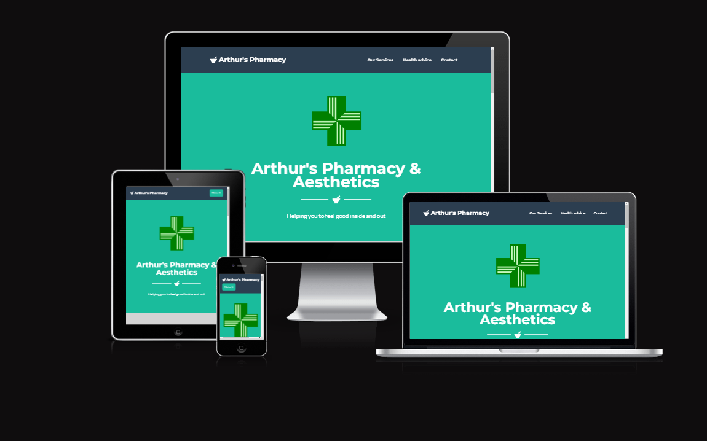
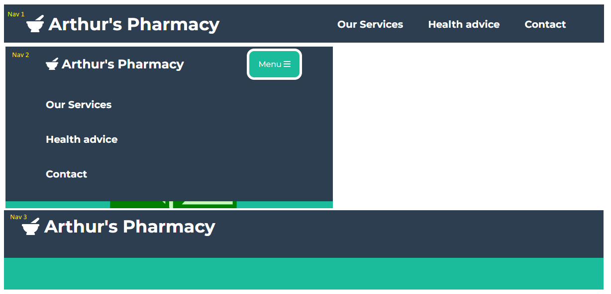
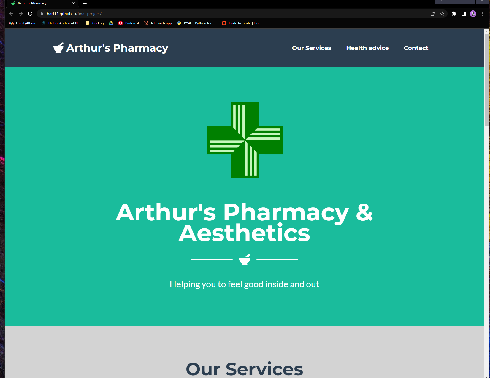
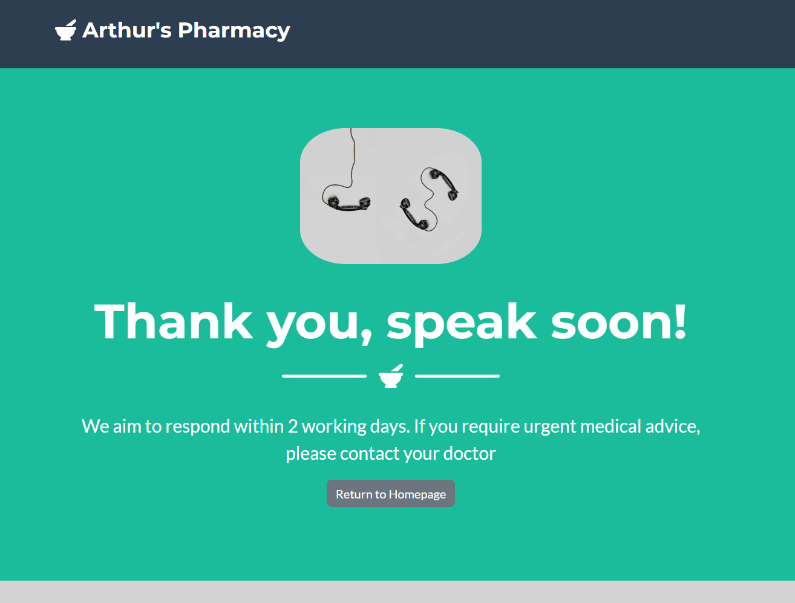
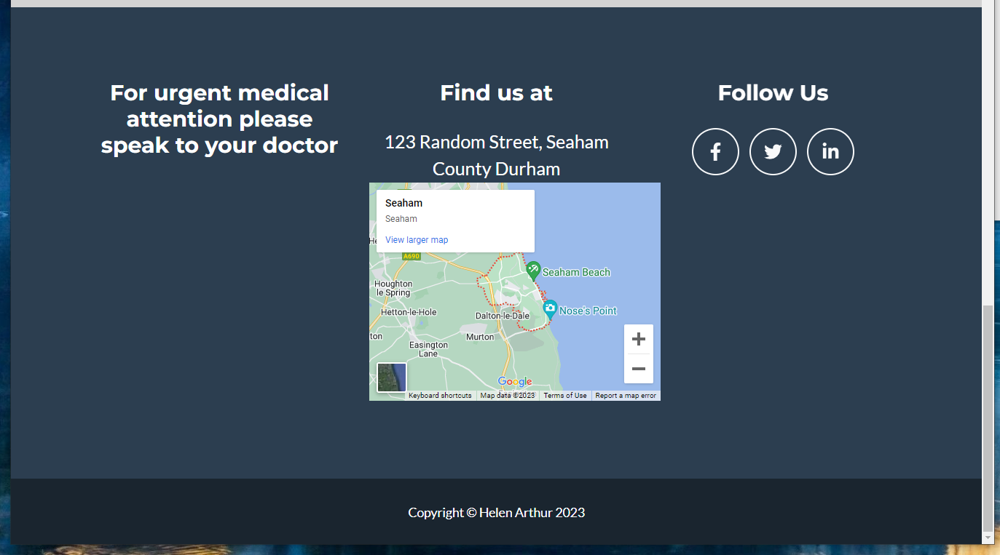

# Arthur's Pharmacy

This website was created for the required Milestone Project One for the Code Institutes Web Development Course using Bootstrap template "Freelancer"

The live website can be found [here](https://hart11.github.io/final-project/)

I wanted to build a website for my own fictional pharmacy. The design is a simple and effective one page scrolling site with internal links to sections, with a contact form for users to get in touch with enquires. 
Important to be aware that all pharmacies are registered with the General Pharmaceutical Council and require a registration logo with registration number. This has NOT been included. 

  

## Arthur's Pharmacy Overview
***
The site provides interactive modals demonstrating the services this fictional pharmacy can provide. Brightly coloured of images lure the user in. The site would allow a user to sign up to arrange prescription delivery, or wish to find out more information. This is done through a contact form.
The target audience is the younger generation of pharmacy users, with links to a fictional presence on social media, by dipping into and expanding on the usual pharmacy role of prescriptions by offering aesthetic treatments such as fillers. 

  

Responsiveness has been tested on https://ui.dev/amiresponsive, different mobile devices and using the developer tools from Chrome. It did look when using the Chrome developer tools, that the header image did not fit to page. This doesn't appear to be the case on the actual devices. 

 
 

## Table of Contents
* [Project Research](#project-research)
* [User Experience Design (UX)](#User-Experience-Design)
  * [User stories](#User-Stories)
    * [First Time Visitor Goals](#First-Time-Visitor-Goals)
    * [Returning Visitor Goals](#Returning-Visitor-Goals)
    * [Frequent User Goals](#Frequent-Visitor-Goals)
  * [Features](#Features)
    * [Existing Features](#Existing-Features)
    * [Navigation Bar](#navigation-bar)
    * [The Home Page](#the-home-page)
    * [Website Footer](#website-footer)
    * [Future Features](#future-features)
  * [Design](#Design)
    * [Colour Scheme](#Colour-Scheme)
    * [Typography](#Typography)
    * [Imagery](#Imagery)
    * [Wireframes](#Wireframes)
* [Technologies](#Technologies)
* [Test Strategy](#test-strategy)
    * [User Stories Testing](#user-stories-testing)
    * [Manual Testing](#manual-testing)
    * [Feedback from User Testing](#feedback-from-user-testing)
    * [Validator Testing](#validator-testing)
    * [Unfixed Bugs](#unfixed-bugs)
* [Deployment](#Deployment)
* [Credits](#Credits)
  * [Code](#Code)
  * [Content](#Content)
  

## Project Research 
***
As a pharmacist, I've found some of the larger pharmacy chains to have busy websites with adverts selling produtcs. The idea of this website was to strip this back to what healthcare services a pharmacy can provide. 
  

 ### Research Analysis
  ***
Pharmacy services are changing, and targetting the younger users would prefer to visit a bright, fun and interactive site. Especially with a contact form on to find out more information.
  

## User Experience Design
***
## User stories
 

#### First Time Visitor Goals

- As a First Time user, I want to easily understand the main purpose of the site and learn more about this fictional pharmacy.
- As a First Time user, I want to be able to navigate throughout the site pages to find relevant content.
- As a First Time user, I want to view the website and content clearly on the device I am currently using and switch between devices and have the webpage be responsive.

### Returning Visitor Goals

- As a Returning user, I want to contact the pharmacy to arrange prescriptions or another service.
- As a Returning user, I may want follow them on social media.

### Frequent Visitor Goals

- As a Frequent user, I want to send another message to the pharmacy.
- As a Frequent user, I may want to arrange another service.

  

 ## Features
 ***
 ## Existing Features 

 

 * ### Navigation Bar
***

  

 * The navigation bar is present across the main page, and on the message response page. The message response page does not have the dropdown menu, but a user can return to the home page (index.html) by either clicking on the Arthur's Pharmacy logo, or the "Return to Homepage" underneath the thank you message. 
  The nav bar is fully responsive, and a burger menu appears when device size is reduced.
  There has been little styling added to the default navigation menu from the template. The colour choice provides a good contrast with the rest of the page. It does however now include a mortar and pestle Font Awesome icon, and uppercase was removed.
  The options were kept simple and clear, with links to internal markers on the main page.
  - Nav 1 shows the nav-bar of the standard bar as displayed on a desktop.
  - Nav 2 show the bar drop down menu from the burger menu on smaller screens.
  - Nav 3 shows the nav-bar as displayed on the message response page, which intentionally does not contain the burger menu drop down.
  

* ### The Home page
***

  - The website design is one single home page, broken up into sections and navigated using internal links.
   The first section is "Our Services" giving the user bold and colourful images to lure users in. Clicking on the service generates a modal pop-up giving the user more information on that particular service. 
   The icon and text have been added so when hoovered over, the user can see what the image relates to. The image within the modal is different to the outer image. For example, the image of a young woman with a map leads to a vaccination modal with an image of a vaccine. This may put some people off if they have a needle phobia for example!
   
  - The second section is used to highlight the health advice the pharmacy can provide. This could be expanded to include advice on certain conditions, but would be too large to add in at this point. Instead, a link to the external NHS 111 website has been provided.
  
  - The third section is the contact form. Users can fill in this form to send the pharmacy a message. The enquiry section is a drop down menu to help the user direct the query to the correct channel.
  Once the user has completed the form and submitted, a thank you message appears. 

  - The Home page is fully responsive.
  

* ### Message Response Page
***

  - The message response page is a short, simple and bold design added in to the website. It is the second of two pages. I decided again including more on this page.
  - The navigation bar and burger menu was not included on this page, but replaced with a return to home page button at the end of the message, customised to be of similar style to the previous page.
  - This page is also responsive.
  
     

* ### Website Footer
***

 - The footer present on the home page holds links to its social media pages. Each link will open in a new tab to allow the user to easily switch between the two and not lose their original position on website. Footer uses Font Awesome icons.
 - The footer also contains a location map which the user can interact with, a fictional adress, and a message to contact a doctor is they have an urgent medical query.
 
 - The links are Facebook, Twitter and LinkedIn. Copyright information is also displayed.
  

* ### Future Features
***
  * An aesthetics section to include price list and how to arrange a consultation
  * As part of expanding the aesthetics side of the page, a responsive image gallery of previous cilents would be of benefit to the user.

  

## Design
***
   * ### Colour Scheme
      I wanted a colour scheme based around pharmacy and clinical colours - namely green, greys and white, to portray clean, crisp and bold styling. Fortunately the ideal green was already in the Bootstrap CSS from the Freelancer template. I did change the colours on the nav-bars, but reverted back to the default as the grey was a good unisex colour.
  * ### Favicon 
      I used the [Favicon.io](https://favicon.io/) website to create a favicon for my website. I wanted a mortar and pestle - a renowned image associated with pharmacy. I used the Font Awesome icon and styled it - using favicon to produce the file.
  * ### Typography
      I used the font within the template as I found this clean, fun and bold. I wanted a simple yet professional looking font, so avoided cursive or handwritting styles.
  * ### Imagery
      All imagery was sourced from pexels.com and had appropriate commercial licenses.

      I opted for images for links as opposed to an image gallery. Images were chosen that had bold colours and to act as click-bait.
  * ### Layout
      I eventually decided on a single flowing page. The bulk of the website information is presented on the homepage, which is neatly displayed using a bootstrap template which I have customised with my own CSS. 
      Initially I had designed a multiple paged website, but this kept on expanding beyond the scope of this project, so opted for a single scrolling page more suited to mobile users as the website is intending to target the younger user.

  

## Wireframes
***
Using Balsamiq I created wireframes for both a desktop browser and mobile phone browser. Please click links below:

- [Desktop Home Page Wireframe](assets/wireframes/Homepage.pdf)
- [Desktop Aesthetics Wireframe](assets/wireframes/aesthetics.pdf)
- [Desktop Contact us Wireframe](assets/wireframes/contact.pdf)
- [Desktop Services Wireframe](assets/wireframes/services.pdf)
- [Mobile device Wireframe](assets/wireframes/mobile.pdf)

 

## Technologies
***
* HTML
	* This project uses HTML as the main language used to complete the structure of the Website. The Gitpod template used was created by Code Institute
* CSS
	* This project uses custom written CSS to style the html.
* [Bootstrap](https://getbootstrap.com/)
	* The layout of the website was created from a Bootstrap template called Freelancer. The CDN is present in the head of the HTML code and the Javascript script required is present at the end of the HTML code.
* [Font Awesome](https://fontawesome.com/)
	* Font awesome icons are present throughout the website - the Navbar Brand (site logo) is prefixed with a font awesome icon. Each section includes a font awesome icon relevant to each piece of content. The footer present on each page also uses font awesome icons for each of the social media links. 
* [GitHub](https://github.com/)
	* GitHub was the hosting site used to store the source code for the Website and [Git Pages](https://pages.github.com/) is used for the deployment of the live site.
* [Gitpod](https://git-scm.com/)
	* Git was used to create and edit all code used to build the website and store assets. It also functions as version control software to commit and push code to the GitHub repository where the source code is stored.
* [Google Chrome Developer Tools](https://developers.google.com/web/tools/chrome-devtools)
	* Google chromes built in developer tools are used to inspect page elements and help debug issues with the site layout and test different CSS styles. Allows the testing of features/code without editing of your own HTML/CSS.
* [balsamiq Wireframes](https://balsamiq.com/wireframes/)
	* This was used to create wireframes for 'The Skeleton Plane' stage of UX design. Although this changed during the design.
* [MS PAINT](https://support.microsoft.com/en-us/windows/get-microsoft-paint-a6b9578c-ed1c-5b09-0699-4ed8115f9aa9)
    * Used to edit some of the images present on the website, mainly those used in the navigation bar.
* [Post CSS](https://postcss.org/)
    * I ran my code through this tool to ensure no errors were present and it was recommended to use to fix any errors with Ipad resolutions. 
* [Favicon](https://favicon.io/)
    * Favicon.io was used to make the site favicon - the font icon itself was taken from Font Awesome.

 

## Test Strategy 
***

 ### Testing
  Testing for this website was done using the built-in Chrome Developer Tools to check responsiveness on different screensizes and general debugging. Testing was also done on an iPhone 10 using Safari and other mobile devices. No issues were found with responsiveness and previous issues have been dealt with through custom screen aspect media queries.
  
  In addition to my own testing, I sent my website link to family and friends and asked for them to test the website out using the same methods listed below. With thanks to Graeme Arthur for peer review and testing.

The website contains no backend functionality therefore testing will concentrate on:

* Testing navigational links open on an external page, as well as the site logo which is designed to redirect to the home page
* Testing the responsiveness of the website, making sure the layout and navigational features remain user friendly with UX design maintained
* Testing of the form to ensure it functions correctly and does not allow an incomplete entry.
* Testing the modals work correctly and display at all resolution breakpoints
* Testing of social media links.

  

#
   ### Manual Testing
***
  * Navigation - Repeated steps on all pages.
       * Click on logo to confirm that it navigates to landing page.
       * Click on all navigation links to verify that they direct to the indicated page.
        * Verify that the navigation menu is responsive to screen size and switches the navigational links to the "hamburger" icon on appropriately sized screens.
        * Ensure the hamburger menu opens correctly and displays the navigational links
          
      * Home page
        * Verify that the google maps and youtube video load on all browsers and at all breakpoints. 
        * Verify that the images are correctly shown on all browsers and at all breakpoints.
        * Verify that the buttons present the user with the correct modals and external documents. Ensure that the modals display correctly on all screen sizes and can be closed easily by the user to return to the page behind.
        
          
      * Thank you page
        * Verify that page displays correctly, acknowledging the users form input.
        * Verify that the user can navigate back to the home page using button.
          
      * Footer 
        * Verify that the social media links open in a new tab.
          

  ### Feedback from User Testing
***
  The main piece of feedback from my user testing was a clean, following design. 
    
        
### Validator Testing 
***
- HTML
  - No errors were returned when passing through the official [W3C validator]
- CSS
  - No errors were found when passing through the official [(Jigsaw) validator]
  

### Unfixed Bugs
***
There are no unfixed bugs present within the website. 
  

## Deployment
***
Once the development process was well underway, the website was deployed to GitHub pages. 

  

* ### Code
 
The html and CSS code for the form was taken from the Bootstrap Freelancer template. I then customised areas with my own custom CSS to redesign it to fit in with my website design and layout. 
Bootstrap was used for all other code and styled using my own custom CSS. https://startbootstrap.com/theme/freelancer 

I referred to W3Schools, Stack Overflow and peers when I encountered issues, which were primarily to do with layout issues and media queries. 

* ### Content
 
The images used in the project were all sourced from pexels.com or google images, ensuring they were available for commercial use.
The Google Maps API was created using google maps.

All icons used on the website were taken from [Font Awesome](https://fontawesome.com/)

Readme based on and adatped from https://github.com/GraeA85/Sprouton-Allotments with permission.